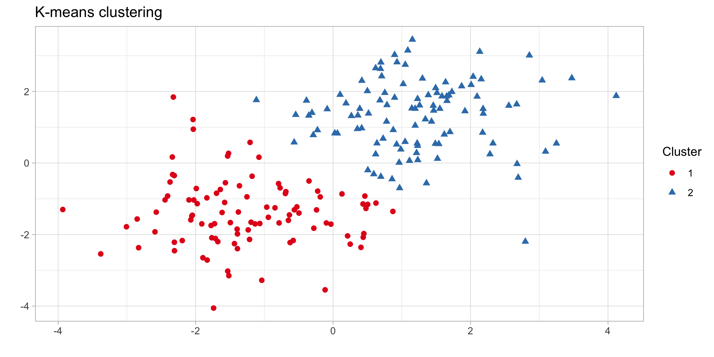
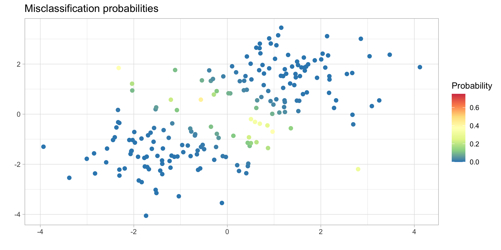

In this tutorial we describe the steps for obtaining Figure 1 of the paper by [Rigon, T., Herring, A. H. and Dunson, D. B. (2020)](https://arxiv.org/abs/2006.05451). The [documentation](https://github.com/tommasorigon/GBClust/raw/master/GBClust_0.0.2.pdf) of the package is available in this repository.

All the analyses are performed with a **MacBook Pro (macOS Big Sur, version 11.0.1)**, using a `R` version **4.0.3** and the `GBClust` package, which must be installed. Notice that matrix decompositions involved in this code might differ across operating systems. 

The code described below requires the installation of the `GBClust` package, available in this repository. See the [README](https://github.com/tommasorigon/GBClust/blob/master/README.md) for instructions on the installation.

As a preliminary step, we load on a clean environment all the required libraries.

```r
library(GBClust)
library(ggplot2)
library(mcclust)
library(mvtnorm)

rm(list = ls())
```

In first place, we simulate some data from multivariate Gaussian distributions.

```r
d <- 2 # Dimension of the data
H <- 2 # Number of clusters
n <- 200 # Sample size

# Parameters
sigma2 <- 1 # Variance
G0 <- rep(1:H, each = n / H) # True clusters
mu <- matrix(c(-1.2, 1.2, -1.2, 1.2), 2, 2) # Mean parameters

# Simulation of the dataset
set.seed(1234)
dataset <- NULL
for (h in 1:H) {
  dataset <- rbind(dataset, rmvnorm(n = n / H, mean = mu[h, ], sigma = sigma2 * diag(d)))
}
```

We obtain the k-means clustering solution (`kmeans2` function) and the associated uncertainty (`kmeans_gibbs` function). The latter is an implementation of the Gibbs sampling algorithm described in **Theorem 1** of the paper in the k-means case. 

```r
# K-means algorithm
fit <- kmeans2(dataset, k = H, nstart = 10)

# K-means Gibbs-sampling
fit_gibbs <- kmeans_gibbs(dataset, k = H, a_lambda = 0, b_lambda = 0, R = 5000, burn_in = 1000, trace = TRUE)
```

The function `Miscl` compute the misclassification probabilities. The medoids are instead computed through the `comp_medoids` function of the `GBClust` package. 

```r
Miscl <- function(S, cluster, medoids) {
  pr_miscl <- numeric(nrow(S))
  for (i in 1:n) {
    Gi <- cluster[i]
    pr_miscl[i] <- 1 - S[i, medoids[cluster[i]]]
  }
  pr_miscl
}

SGibbs <- mcclust::comp.psm(fit_gibbs$G)

D <- as.matrix(dist(dataset, method = "euclidean"))^2 # Dissimilarity matrix
MisclGibbs_pr <- Miscl(SGibbs, fit$cluster, comp_medoids(D, fit$cluster))
```

In figure `p1` we represent the simulated data. Colors represent the kmeans clustering solution.

```r
p1 <- ggplot(data = data.frame(dataset, Cluster = as.factor(fit$cluster)), aes(x = X1, y = X2, col = Cluster, shape = Cluster)) +
  geom_point(size = 2) +
  theme_light() +
  xlab("") +
  ylab("") +
  scale_color_brewer(palette = "Set1") +
  ggtitle("K-means clustering")
  
p1
ggsave("tutorial/plot1_1.png",width=8.8,height=4.4)
```



In figure `p2` we again represent the simulated data. Colors represent the misclassification probabilities.

```r
# Misclassification probabilities
data_plot <- rbind(data.frame(dataset, Probability = MisclGibbs_pr))
p2 <- ggplot(data = data_plot, aes(x = X1, y = X2, col = Probability)) +
  geom_point(size = 2) +
  theme_light() +
  xlab("") +
  ylab("") +
  scale_color_distiller(palette = "Spectral", direction = -1, limits = c(0, .75)) +
  ggtitle("Misclassification probabilities")
p2
ggsave("tutorial/plot1_2.png",width=8.8,height=4.4)
```


